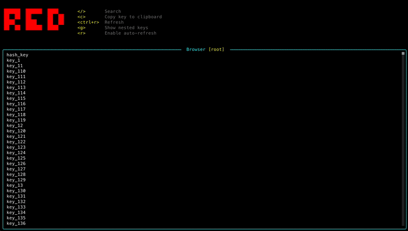

# Red 🔴
A TUI Redis client to inspect and manage your Redis databases.
Inspired by [k9s](https://github.com/derailed/k9s).



> ⚠️ This is a work in progress. At time of writing, it's a little project I'm working on for two main reasons:
> - Because I actually want something like this for my own use
> - To explore [OpenTUI](https://github.com/sst/opentui)
>
> It's yet to be seen how far I'll take this. If you're from the far future and this message is still here, then it probably means it never got anywhere beyond a prototype stage :\)

## Installation using Homebrew
```sh
brew tap evertdespiegeleer/tap
brew install red-cli
```

## Usage
```sh
red --connection-string="redis://localhost:6379"
```

## Command line arguments
Run `red --help` to see all available command line arguments.

## Configuration
Configuration can be provided in multiple ways. In decreasing order of precedence:
1. Command line arguments
2. Environment variables
3. Configuration file
4. Built-in defaults

### Environment variables
- `RED_CONNECTION_STRING`: The Redis connection string (e.g. `redis://localhost:6379`)

### Configuration file
Create a configaration file in the directory where you run `red`. The following filenames are supported:

.redrc
.redrc.json
.redrc.yaml
.redrc.yml
.redrc.js
.redrc.ts
.redrc.cjs
red.config.js
red.config.ts
red.config.cjs

Eg:
```json
{
    "$schema": "https://github.com/evertdespiegeleer/red-cli/releases/download/v0.0.5/.redrc.schema.json",
    "connectionString": "redis://localhost:6379"
}
```

### 

## Development
Initialize the repository:
```sh
./scripts/init.sh
```

Run the project:
```sh
bun run dev
```